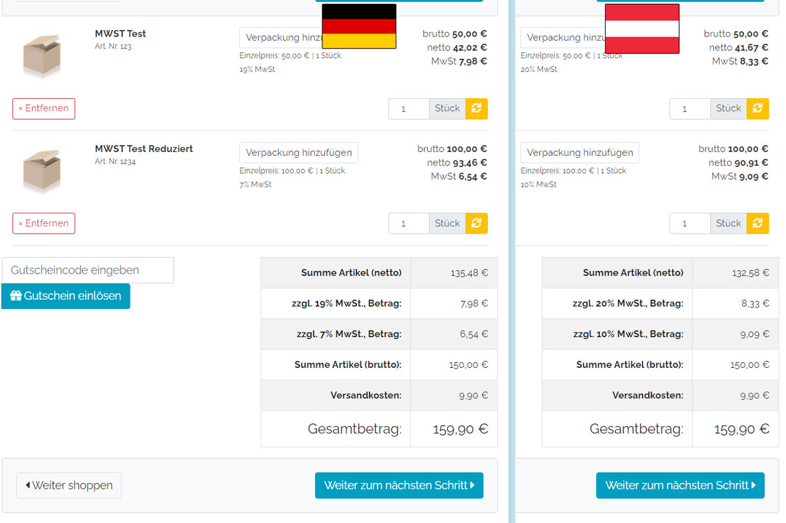

## Länderspezifische Mehrwertsteuer + fester Brutto-Preis unabhängig vom Steuersatz Für OXID eShop
### Modul Version 2.1.1

Bei länderspezifischen Mehrwertsteuersätzen berechnet OXID zuerst den Netto-Preis und addiert dann die jeweiligen MwSt dazu, wodurch sich der Bruttopreis im WK ändert.
Dieses Modul lässt den Brutto-Preris unabhängig vom Steuersatz gleich bleiben, so dass der Netto-Preis jeweils angepasst wird. 

## Installation & Konfiguration:
* Composer Befehl ausführen: `composer require vanilla-thunder/oxid-module-staticbrutto`
* In den Einstellungen den Standard-Steuersatz hinterlegen (z.B. 19% für DE)
* Prüfen, ob alle benötigten Länder aktiv sind
* Modul aktivieren
* Admin neuladen
* Unter "Stammdaten" -> "Mwst. Sätze" die Mehrwersteuersätze eintragen und speichern

## Funktionsweise 

Falls der Artikel über keinen eigenen Steuersatz verfügt, wird der jeweils volle Steuersatz für das aktuell ausgewählte Rechnungsandressen-Land genommen, sonst der reduzierte Steuersatz.

### Beispielrechnung:
Standard Steuersatz: 19%  
Produkt hat keinen eigenen Steuersatz + Lieferland Österreich -> 20% (bzw das, was ihr eingetragen habt)  
Produkt hat 7% + Lieferland Österreich -> 9% (bzw das, was ihr eingetragen habt)  

Bitte Prüft vorher, ob ihr Produkte im Shop habt, die in DE einem reduzierten MwSt Satz unterliegen, in einem anderen Land aber einem vollen MwSt Satz. Wenns so ist, schreibt mich an, wir finden schon eine Lösung. 

### LICENSE AGREEMENT
   country specific VAT and static brutto price no matter of VAT percentage  
   Copyright (C) 2021   
  
   This program is free software;  
   you can redistribute it and/or modify it under the terms of the GNU General Public License as published by the Free Software Foundation;
   either version 3 of the License, or (at your option) any later version.
  
   This program is distributed in the hope that it will be useful, but WITHOUT ANY WARRANTY;  
   without even the implied warranty of MERCHANTABILITY or FITNESS FOR A PARTICULAR PURPOSE. See the GNU General Public License for more details.
   You should have received a copy of the GNU General Public License along with this program; if not, see <http://www.gnu.org/licenses/>
